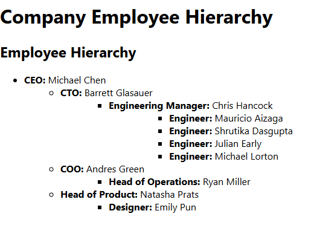

# 🏢 Employee Hierarchy System

## 🚀 Overview
This project provides a **Go backend** that serves employee hierarchy data and a **React frontend** that displays it in a **nested structure**. The system ensures that employees are grouped under their respective managers, sorted alphabetically by last name.

---

## 📂 Project Structure
```
employee-hierarchy/
│   main.go           # Main Go application
│── employee-hierarchy/             # React Frontend
│   ├── src/
│   │   ├── EmployeeHierarchy.js  # React Component
│   │   ├── App.js        # Main App Entry
│   ├── package.json      # React Dependencies
│── README.md             # Project Documentation
```

## 🔧 Installation & Setup

### 1️⃣ Clone the Repository
```sh
git clone https://github.com/reactchain/go-react-employee.git
cd go-react-employee
```

---

### 2️⃣ Run the Go Backend
```sh
go run .
```
The server will be running at: **`http://localhost:8080`**

---

### 3️⃣ Run the React Frontend
```sh
cd employee-hierarchy
npm install
npm start
```
The React app will be available at: **`http://localhost:3000`**

---



---

## 📜 License
MIT License © 2025 
